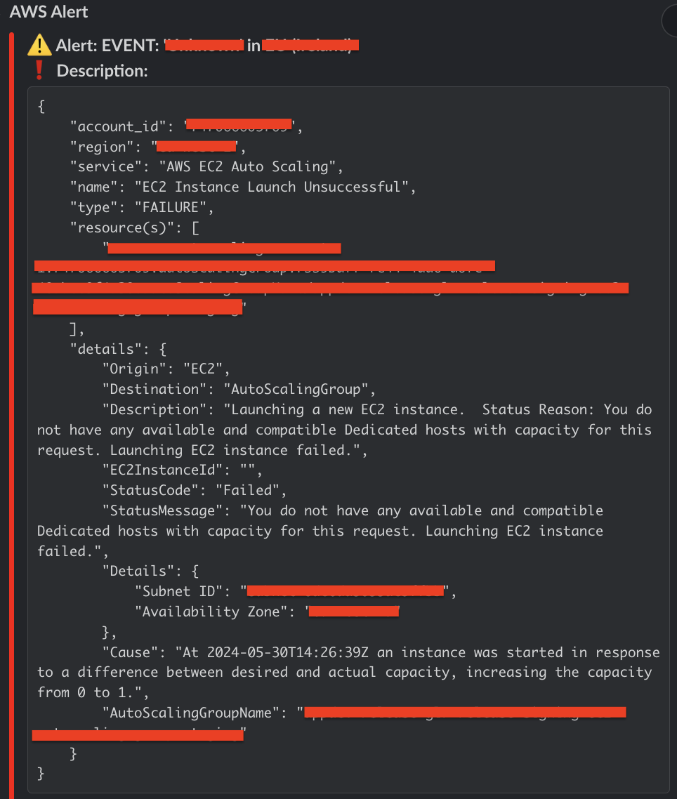

# AWS Alerts

**AWS Alerts** is an automated monitoring and alerting solution for AWS Cloud. It supports 30+ AWS services and sends alerts to Slack for **failures**, **errors**, **warnings**, and **terminations**. You can enable alerts per service using provided configuration variables.

> ⚠️ All services are disabled by default. You must explicitly enable the alerts you need.

---

## ❓ Why AWS Alerts?

Setting up infrastructure-level alerting manually across AWS services can be time-consuming and error-prone. While AWS offers tools like **CloudWatch**, **EventBridge**, and **service-specific event subscriptions**, wiring them together for complete coverage involves significant effort.

**AWS Alerts** simplifies this by:
- Automating the creation of required resources
- Using Infrastructure as Code (Terraform or CloudFormation)
- Providing a central alert delivery system via Slack

---

## 📸 Example Notifications

- **CloudWatch/EventBridge Event Notification**

  

- **CloudWatch Alarm Notification**

  

---

## 🛠️ Supported Infrastructure as Code Tools

- **Terraform**
- **AWS CloudFormation**

---

## ✅ Supported AWS Services

You can enable alerting for over 30 AWS services, including:

- AWS Batch  
- AWS CodeBuild / CodeDeploy / CodePipeline  
- AWS Config  
- AWS Data Lifecycle Manager  
- AWS DMS (Database Migration Service)  
- AWS DataSync  
- AWS EBS / EC2 / EC2 Auto Scaling  
- AWS ECS / EMR  
- AWS Elemental  
- AWS GameLift  
- AWS Glue  
- AWS Health  
- AWS IoT  
- AWS KMS  
- AWS Lambda  
- AWS Macie  
- AWS OpsWorks  
- AWS RDS / Redshift  
- AWS SageMaker  
- AWS Server Migration Service  
- AWS Signer  
- AWS Step Functions  
- AWS Systems Manager  
- AWS Transcribe  
- AWS Trusted Advisor

---

## 🔧 Components Used

- **Terraform template** for resource provisioning
- **CloudFormation template** as an alternative IaC option
- **AWS Lambda (Python 3.12)** using:
  - Boto3
  - Custom Slack message formatting
- **IAM Role** with least privileges for Lambda
- **SNS Topic** to aggregate and forward events to Slack
- **CloudWatch/EventBridge** rules to capture alerts
- **RDS/DMS event subscriptions**
- **SSM Parameter Store** for securely storing the Slack Webhook URL

---

## 🧰 Prerequisites

Before deploying, ensure the following are installed/configured:

- [Git](https://git-scm.com/)
- [AWS CLI](https://aws.amazon.com/cli/)
- [Terraform](https://www.terraform.io/)
- Python 3.12 with `pip`
- A **Slack Webhook URL** for the target Slack channel
- A **SSM Parameter** with the Slack Webhook URL as its value

---

## 🚀 Deployment & Usage

### 📦 Deploy Using Terraform

Following are the steps to successfully deploy and use this solution:
-   Fork this repository from the master branch.
-   Use `terraform-usage-example.tf` file to create `main.tf` file for your infrastructure as needed.
-   Set the value for the `slack_webhook_url_aws_ssm_parameter_name` variable to the name of the AWS SSM Parameter name from the Parameter Store which is having Slack Webhook URL.
-   For any AWS service that you want to enable alerts for failures, errors, warnings and/or terminations notifications, set the value to `true` for its variable that is starting with the prefix `enable_...` (e.g., `enable_rds_failure_warning_alerts`). By default, all are set to `false`.
-   If `enable_lambda_failure_alerts` variable is set to to `true` for AWS Lambda functions' failure alerts, you can set a list of specific AWS Lambda functions to enable monitoring only for them by using `lambda_function_names` variable. Otherwise, it will fetch all the AWS Lambda function names.
-   Configure AWS CLI and then run `terraform init` and then `terraform apply`.
-   If the Terraform change plan looks good, enter `yes` to create the resources.
-   Wait for the Terraform to finish creating all the resources.

### Using AWS CloudFormation:

Following are the steps to successfully deploy and use this solution:
-   Fork this repository from the master branch.
-   Run the following command to install the Python libraries: `pip3 install -r ./function/requirements.txt -t ./function --no-cache-dir --upgrade`
-   Compress whatever is inside the `function` directory into a `.zip` file and put it on an AWS S3 bucket.
-   Login to AWS console with IAM user credentials having the required permissions to create resources via AWS CloudFormation.
-   Go to AWS CloudFormation and click on `Create Stack` button and then select `With new resources (standard)` option.
-   Under `Choose a template`, either upload `aws_alerts_cft.yaml` file from the `cloudformation` directory or upload it on an AWS S3 bucket and enter its AWS S3 object URL.
-   Enter any suitable value for `Stack Name`.
-   Enter value for `SlackWebhookURLAWSSSMParameterName` which is the name of the AWS SSM Parameter Name from the Parameter Store which is having Slack Webhook URL.
-   Enter value for `AWSAlertsLambdaCodeS3Bucket` which is an AWS S3 Bucket Name having AWS Alerts Lambda Function Code. (e.g., `my-bucket`).
-   Enter value for `AWSAlertsLambdaCodeS3ObjectKey` which is an AWS S3 Bucket Object Key having AWS Alerts Lambda Function Code (e.g., `lambda/code/aws_alerts.zip`).
-   For any AWS service that you want to enable alerts for failures, errors, warnings and/or terminations notifications, select `YES` for its variable that is starting with the prefix `Enable...` (e.g., `EnableCloudFormationFailureAlerts`). By default, all have `YES` selected.
-   Enter any suitable value for `Tags` if required.
-   Change extra configurations if required.
-   Under `Review`, select `I acknowledge that AWS CloudFormation might create IAM resources with custom names.` and click `Create`.
-   Wait for the stack to change its `Status` to `CREATE_COMPLETE`.

Note: You can subscribe other endpoints to the AWS SNS topic created for alerts if needed.

